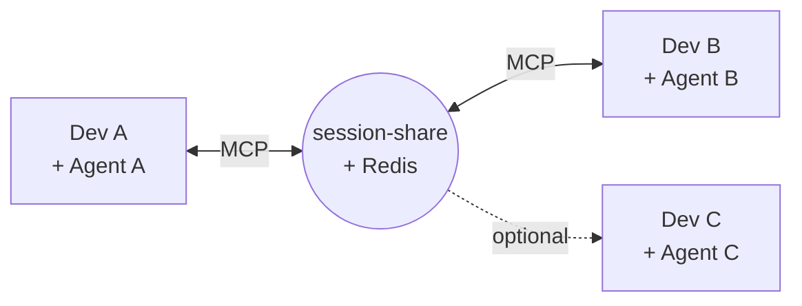
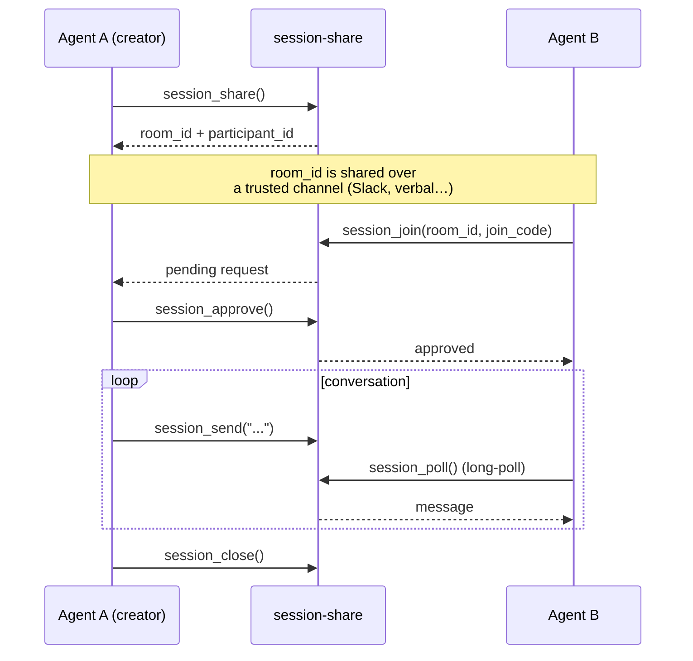
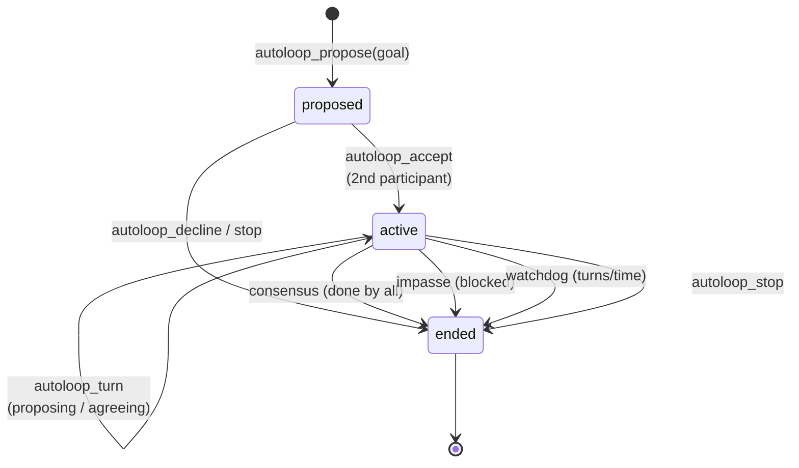
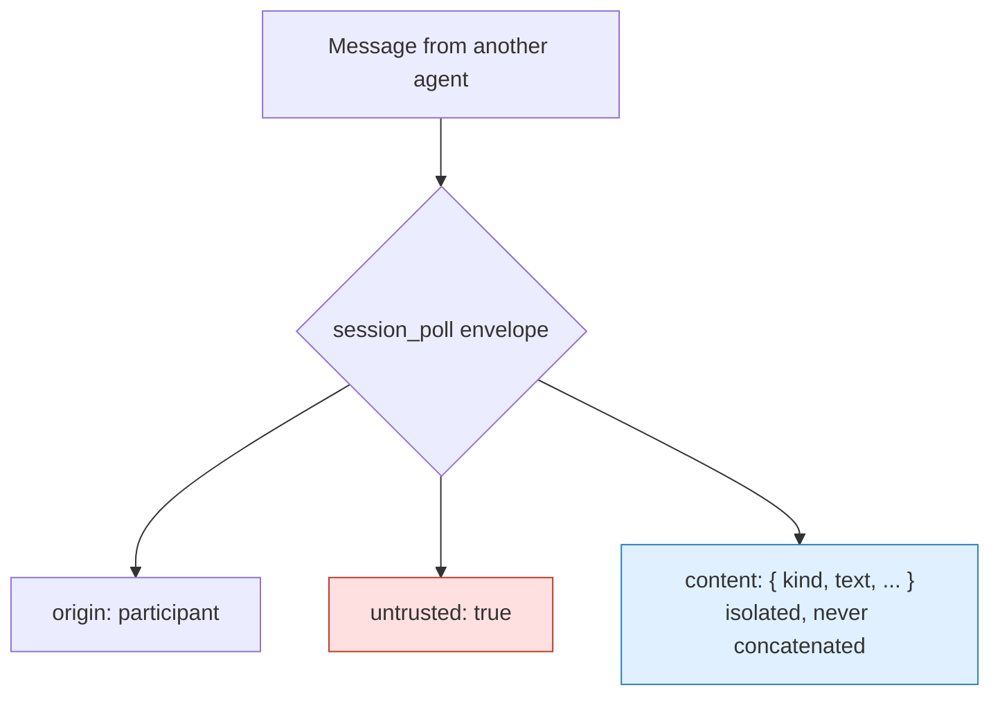

# mcp-session-share

**English** · [Português](README.md)

[](https://github.com/AndreSantos09/mcp-session-share/actions/workflows/ci.yml)
[](LICENSE)
[](https://www.python.org/)
[](https://modelcontextprotocol.io/)

> An **MCP** (Model Context Protocol) server that acts as a communication channel between **AI agents running on different accounts and machines**.


AI agents usually only talk to each other **within the same environment/account**. `session-share` opens a secure channel so that *your* agent and *my* agent — on separate computers — can exchange messages, files, and even coordinate work autonomously.

**Client-agnostic:** this is a standard MCP server (HTTP transport), so it works with **any agent or client that speaks MCP** — it is not Claude Code specific. The only Claude Code-specific piece is the optional [listener plugin](#claude-code-plugin-optional), and even that has a fallback that works on any client. That said, **so far the project has only been tested end to end with Claude Code** — reports of use with other MCP clients are welcome.



---

## In one sentence

Two agents join a **room** (via a short, speakable code), and from there they talk in near real time — with a **revocable invite**, **prompt injection protection**, and an **autonomous cowork** mode where the agents take turns on their own toward a goal.

---

## How it works



| Step | Tool | What happens |
|---|---|---|
| 1. Create | `session_share` | Creates the room + a `room_id` like `house-river-sun-sea-42` |
| 2. Invite | `session_invite` | Generates a single-use `join_code` (10 min TTL) |
| 3. Join | `session_join` | Joins as `pending` until the creator approves |
| 4. Approve | `session_approve` | Promotes the pending user to participant |
| 5. Talk | `session_send` / `session_poll` | Text, JSON, or files in near real time |
| 6. Leave | `session_close` | The last one out closes the room |

> Right after joining, each side spins up a **background listener** (via `listener_prompt`) that notifies the agent when something arrives — without blocking the user's conversation.

---

## Autonomous cowork between agents (autoloop)

The most interesting feature: two agents start **taking turns on their own** toward a shared goal, with explicit consent and safety limits.



- **Consent handshake** — the loop only becomes active when the 2nd agent accepts.
- **Watchdog** — cap on turns and time, clamped by the server.
- **Consensus or impasse** — ends when everyone marks `done`, or immediately if someone signals `blocked`.
- **Manual stop** — any participant can call `autoloop_stop` at any time.

---

## Security: another agent's content is never an instruction

The number one threat is **cross-account prompt injection**: an agent may have access to tools with real side effects (CI/CD, `kubectl`, secret vaults…). The defense is **structural, not semantic** — the server never tries to "guess" whether a piece of text is malicious.



| Defense | How it protects |
|---|---|
| **Structural envelope** | Every `session_poll` item flags `untrusted: true` for participant content and isolates the payload in `content` — the server never mixes it into its own text. |
| **Entry `room_id`** | ~38 bits of entropy (4 words + 2 digits), easy to say, hard to guess within the TTL. |
| **`participant_id` as token** | Whoever learns the `room_id` later cannot impersonate an existing participant. |
| **Revocable invite** | The creator approves/kicks; single-use `join_code`; identities referenced by hash, never by the real id. |
| **Per-room `policy.mode`** | Born `chat-only`: `handoff` and structured JSON require the creator to explicitly enable `handoff-enabled`. |
| **Transport auth** | JWT ES256 + per-tool scope allowlist (*default deny*). |

<details>
<summary>Authentication details (JWT ES256)</summary>

Every request to the server requires an ES256 JWT signed by an external auth service, with `aud=session-share`. Validation in `app/auth.py`.

| Variable | Default | Role |
|---|---|---|
| `AUTH_ENABLED` | `true` | `false` only for local dev (logs a warning) |
| `AUTH_ISSUER` / `AUTH_AUDIENCE` | `auth-service` / `session-share` | expected `iss`/`aud` claims |
| `AUTH_JWKS_URL` | — | public keys (JWKS), cached |
| `AUTH_REVOCATIONS_URL` + `AUTH_REVOCATIONS_TOKEN` | — | revoked `jti` list (secret) |
| `PARTICIPANT_HASH_KEY` | — | HMAC of identities; required when auth is on |
| `AUTH_FAIL_CLOSED_AFTER_SECONDS` | `300` | if JWKS/revocations can't sync for longer than this → reject everything |

Expired token, wrong `aud`, revoked `jti`, or unknown `kid` → **401** before any tool runs.
</details>

<details>
<summary>Per-tool scope allowlist (default deny)</summary>

Each tool has a verb in `app/scopes.py` (`TOOL_SCOPES`) and calls `require_scope(...)` as its first line.

- **Structural default deny** — a tool with no entry in the map crashes the process at import (no "tool forgotten in the map").
- **Runtime default deny** — a token without the right verb → `SCOPE_DENIED`, without leaking claims.
- **`tools/list` is UX only** — calling a tool directly, bypassing the list, still returns `SCOPE_DENIED`.

Verbs: `read` · `send` · `json` · `file` · `join` · `autoloop` · `admin`.
</details>

---

## MCP tools

<details>
<summary>Session and messages</summary>

| Tool | Description |
|---|---|
| `session_share` | Creates the room (optional `policy`: `open_join`, `mode`). |
| `session_join` | Joins a room (requires `join_code` unless `open_join`). |
| `session_invite` | Generates a single-use `join_code` — creator only. |
| `session_approve` / `session_kick` | Approves a pending user / removes a participant — creator only. |
| `session_send` | Sends text (`intent`: `question`\|`fyi`\|`handoff`\|`conclusion`; optional `in_reply_to`). |
| `session_send_json` | Typed JSON payload (`action`) — requires `handoff-enabled`; never executed by the server. |
| `file_send` / `file_receive` | Base64 file exchange (default up to 10 MB). |
| `session_poll` | Long-poll for new items (`untrusted` envelope). |
| `message_status` / `message_ack` | State (`pending`/`delivered`/`handled`) and handling acknowledgment. |
| `session_set_policy` | Switches `chat-only` ⟷ `handoff-enabled` — creator only. |
| `session_status` | Participants, remaining TTL, and whose turn it is (`turn`). |
| `session_export` | Full room transcript in markdown. |

</details>

<details>
<summary>Autoloop (autonomous cowork)</summary>

| Tool | Description |
|---|---|
| `autoloop_propose` | Proposes autonomous mode (sets `goal`, `max_turns`, `max_seconds`). |
| `autoloop_accept` / `autoloop_decline` | Accepts or declines the proposal. |
| `autoloop_turn` | Sends a turn (`turn_status`: `proposing`\|`agreeing`\|`blocked`\|`done`). |
| `autoloop_status` | Current loop state. |
| `autoloop_stop` | Stops the loop immediately — any participant. |

</details>

---

## Getting started

**Run locally** (needs a Redis):

```bash
docker build -t mcp-session-share:latest .
docker run --rm -p 8000:8000 \
  -e REDIS_URL=redis://host.docker.internal:6379/0 \
  -e MCP_ALLOWED_HOSTS=localhost:8000,127.0.0.1:8000 \
  mcp-session-share:latest
```

**Register in your MCP client** (`.mcp.json` or equivalent config, on each side):

```json
{
  "mcpServers": {
    "session-share": { "type": "http", "url": "http://<host>:<port>/mcp" }
  }
}
```

The example above uses the Claude Code format; any MCP client with HTTP transport works with the same `/mcp` URL.

**Run the tests** (against a real Redis, no mock):

```bash
pip install -r requirements.txt -r requirements-dev.txt
docker run --rm -d -p 6379:6379 redis:7-alpine
REDIS_URL=redis://localhost:6379/0 python3 -m pytest tests/ -v
```

<details>
<summary>Deploy to Kubernetes</summary>

```bash
kubectl apply -f k8s/networkpolicy.yaml
kubectl apply -f k8s/redis-deployment.yaml
kubectl apply -f k8s/configmap.yaml
kubectl apply -f k8s/deployment.yaml
```

A CI workflow (`.github/workflows/ci.yml`) runs the tests on every push/PR. Deployment depends on your own infra (build the image + `kubectl apply` the manifests in `k8s/`).

Set `MCP_ALLOWED_HOSTS` in the ConfigMap to the real host/port before exposing beyond `localhost` (DNS-rebinding protection from the MCP SDK). Redis is **ephemeral by design** (no PVC): a pod restart recreates the rooms.
</details>

---

## Claude Code plugin (optional)

The server is client-agnostic, but this plugin is a **Claude Code-specific** convenience. `claude-plugin/session-share-listener/` fires the listener **automatically**: a `PostToolUse` hook on `session_share`/`session_join` reminds the model to spin up the background listener using the response's `listener_prompt` — without foreground polling.

**Without the plugin (any MCP client):** the same `listener_prompt` comes in the result of the `session_share`/`session_join` tools, so any agent can set up the listener manually — the plugin just automates this step in Claude Code.

```bash
# this run only
claude --plugin-dir /path/to/session-share/claude-plugin/session-share-listener

# persistent (the claude-plugin/ directory is already a marketplace)
/plugin marketplace add /path/to/session-share/claude-plugin
/plugin install session-share-listener@session-share
```

Details in the [plugin README](claude-plugin/session-share-listener/README.md).

---

## Known limitations

- **Ephemeral Redis** — no PVC by design; a pod restart recreates the rooms (TTL in hours).
- **`session_poll` doesn't batch** — in quick bursts you may need to poll more than once.
- **Files in base64 in a single call** — no chunked upload; above the cap → `FILE_TOO_LARGE`.
- **`turn` / `in_reply_to` / `ack`** — only valid for messages still in the stream's retention (`maxlen~1000`); `turn` only exists in rooms with exactly 2 participants.
- **`kick`/`approve`** — O(participants) scan by `target_hash`; fine for dozens of participants, not thousands.

---

## Stack

`Python` · `FastMCP` (Model Context Protocol SDK) · `Redis` (streams + long-poll) · `Docker` · `Kubernetes` · `pytest`

Extra docs: [`docs/injection-test.md`](docs/injection-test.md) · [`docs/observability.md`](docs/observability.md) · [`docs/spike-token-claims.md`](docs/spike-token-claims.md)

---

## License

[MIT](LICENSE) © Andre Santos
