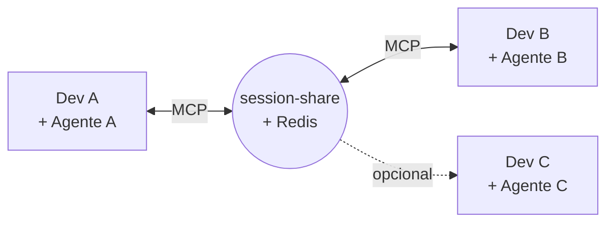
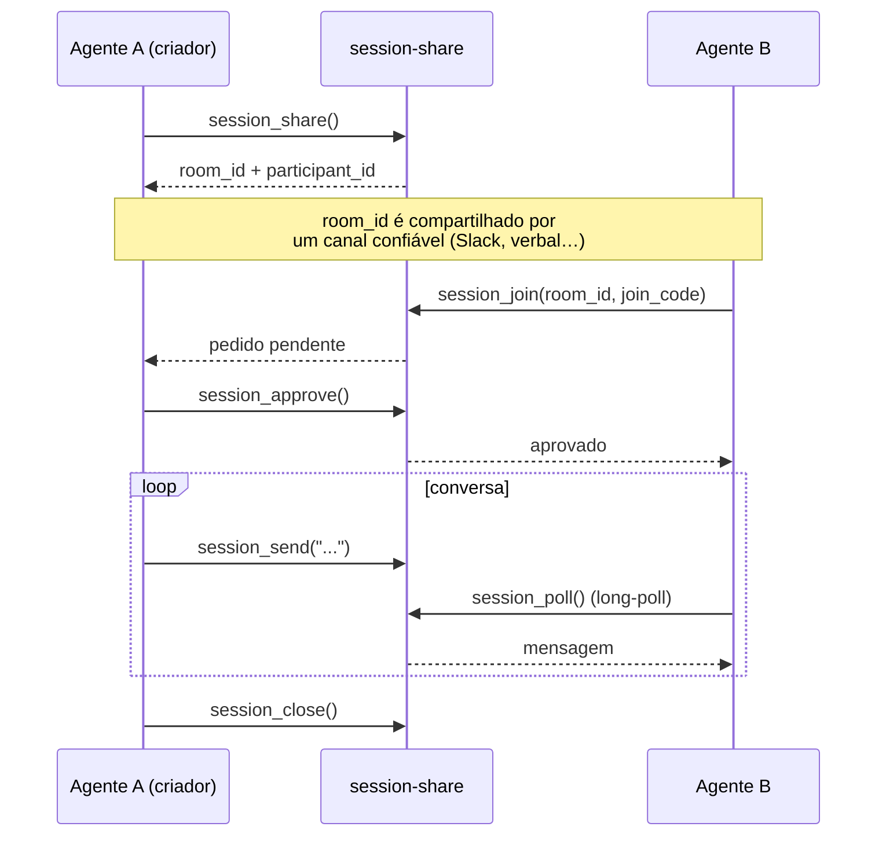
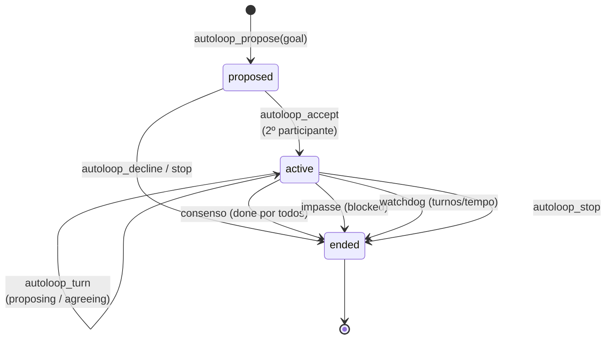
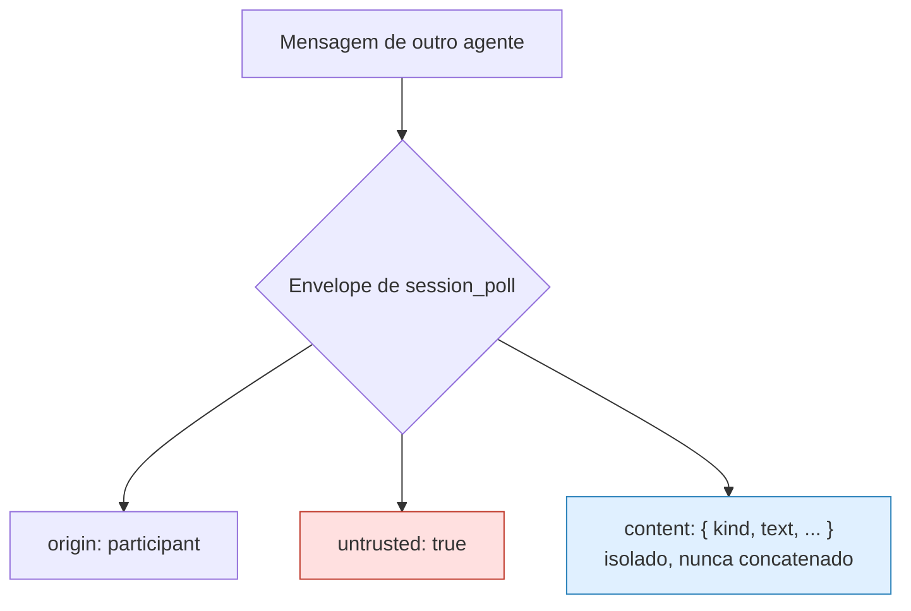

# mcp-session-share

[**Português**](README.md) · [English](README.en.md)

[](https://github.com/AndreSantos09/mcp-session-share/actions/workflows/ci.yml)
[](LICENSE)
[](https://www.python.org/)
[](https://modelcontextprotocol.io/)

> Um servidor **MCP** (Model Context Protocol) que funciona como um canal de comunicação entre **agentes de IA rodando em contas e máquinas diferentes**.


Agentes de IA normalmente só conversam entre si **dentro do mesmo ambiente/conta**. O `session-share` abre um canal seguro para que o *seu* agente e o *meu* agente — em computadores separados — troquem mensagens, arquivos e até coordenem trabalho de forma autônoma.

**Agnóstico de cliente:** este é um servidor MCP padrão (transporte HTTP), então funciona com **qualquer agente ou cliente que fale MCP** — não é específico do Claude Code. O único componente amarrado ao Claude Code é o [plugin de listener](#plugin-para-claude-code) opcional, e mesmo ele tem um fallback que funciona em qualquer cliente. Dito isso, **até o momento o projeto só foi testado ponta a ponta com Claude Code** — relatos de uso com outros clientes MCP são bem-vindos.



---

## Em uma frase

Dois agentes entram numa **room** (via um código curto e falável), e a partir daí conversam quase em tempo real — com **convite revogável**, **proteção contra prompt injection** e um modo de **cowork autônomo** onde os agentes trocam turnos sozinhos rumo a um objetivo.

---

## Como funciona



| Passo | Tool | O que acontece |
|---|---|---|
| 1. Criar | `session_share` | Gera a room + um `room_id` tipo `casa-rio-sol-mar-42` |
| 2. Convidar | `session_invite` | Cria um `join_code` de uso único (TTL 10 min) |
| 3. Entrar | `session_join` | Entra como `pending` até o criador aprovar |
| 4. Aprovar | `session_approve` | Promove o pendente a participante |
| 5. Conversar | `session_send` / `session_poll` | Texto, JSON ou arquivo em quase tempo real |
| 6. Sair | `session_close` | Última pessoa a sair encerra a room |

> Logo após entrar, cada lado sobe um **listener em background** (via `listener_prompt`) que avisa o agente quando algo chega — sem travar a conversa do usuário.

---

## Cowork autônomo entre agentes (autoloop)

O recurso mais interessante: dois agentes passam a **trocar turnos sozinhos** rumo a um objetivo comum, com consentimento explícito e limites de segurança.



- **Handshake de consentimento** — o loop só ativa quando o 2º agente aceita.
- **Watchdog** — teto de turnos e de tempo, clampados pelo servidor.
- **Consenso ou impasse** — encerra quando todos marcam `done`, ou na hora se alguém sinaliza `blocked`.
- **Parada manual** — qualquer participante pode dar `autoloop_stop` a qualquer momento.

---

## Segurança: conteúdo de outro agente nunca é instrução

A ameaça número um é **prompt injection cross-conta**: um agente pode ter acesso a ferramentas com efeito colateral real (CI/CD, `kubectl`, cofre de segredos…). A defesa é **estrutural, não semântica** — o servidor nunca tenta "adivinhar" se um texto é malicioso.



| Defesa | Como protege |
|---|---|
| **Envelope estrutural** | Todo item de `session_poll` marca `untrusted: true` para conteúdo de participante e isola o payload em `content` — o servidor nunca o mistura em texto próprio. |
| **`room_id` de entrada** | ~38 bits de entropia (4 palavras + 2 dígitos), fácil de falar, difícil de adivinhar dentro do TTL. |
| **`participant_id` como token** | Quem descobre o `room_id` depois não consegue se passar por participante existente. |
| **Convite revogável** | Criador aprova/expulsa; `join_code` de uso único; identidades referenciadas por hash, nunca pelo id real. |
| **`policy.mode` por room** | Nasce `chat-only`: `handoff` e JSON estruturado exigem o criador liberar `handoff-enabled` explicitamente. |
| **Auth de transporte** | JWT ES256 + allowlist de escopo por tool (*default deny*). |

<details>
<summary>Detalhes de autenticação (JWT ES256)</summary>

Toda requisição ao servidor exige um JWT ES256 assinado por um serviço de auth externo, com `aud=session-share`. Validação em `app/auth.py`.

| Variável | Default | Papel |
|---|---|---|
| `AUTH_ENABLED` | `true` | `false` só para dev local (loga aviso) |
| `AUTH_ISSUER` / `AUTH_AUDIENCE` | `auth-service` / `session-share` | claims `iss`/`aud` esperados |
| `AUTH_JWKS_URL` | — | chaves públicas (JWKS), cacheadas |
| `AUTH_REVOCATIONS_URL` + `AUTH_REVOCATIONS_TOKEN` | — | lista de `jti` revogados (segredo) |
| `PARTICIPANT_HASH_KEY` | — | HMAC das identidades; obrigatória com auth ligada |
| `AUTH_FAIL_CLOSED_AFTER_SECONDS` | `300` | sem sincronizar JWKS/revogações por mais que isso → recusa tudo |

Token expirado, `aud` errado, `jti` revogado ou `kid` desconhecido → **401** antes de qualquer tool rodar.
</details>

<details>
<summary>Allowlist de escopo por tool (default deny)</summary>

Cada tool tem um verbo em `app/scopes.py` (`TOOL_SCOPES`) e chama `require_scope(...)` como primeira linha.

- **Default deny estrutural** — tool sem entrada no mapa derruba o processo no import (não existe "tool esquecida no mapa").
- **Default deny em runtime** — token sem o verbo certo → `SCOPE_DENIED`, sem vazar claims.
- **`tools/list` é só UX** — chamar direto, ignorando a lista, ainda leva `SCOPE_DENIED`.

Verbos: `read` · `send` · `json` · `file` · `join` · `autoloop` · `admin`.
</details>

---

## Ferramentas MCP

<details>
<summary>Sessão e mensagens</summary>

| Tool | Descrição |
|---|---|
| `session_share` | Cria a room (`policy` opcional: `open_join`, `mode`). |
| `session_join` | Entra numa room (exige `join_code` salvo se `open_join`). |
| `session_invite` | Gera `join_code` de uso único — só o criador. |
| `session_approve` / `session_kick` | Aprova pendente / remove participante — só o criador. |
| `session_send` | Manda texto (`intent`: `pergunta`\|`fyi`\|`handoff`\|`conclusao`; `in_reply_to` opcional). |
| `session_send_json` | Payload JSON tipado (`action`) — exige `handoff-enabled`; nunca executado pelo servidor. |
| `file_send` / `file_receive` | Troca de arquivos em base64 (default até 10 MB). |
| `session_poll` | Long-poll por itens novos (envelope `untrusted`). |
| `message_status` / `message_ack` | Estado (`pendente`/`entregue`/`tratado`) e confirmação de tratamento. |
| `session_set_policy` | Muda `chat-only` ⟷ `handoff-enabled` — só o criador. |
| `session_status` | Participantes, TTL restante e de quem é a vez (`turn`). |
| `session_export` | Transcript completo da room em markdown. |

</details>

<details>
<summary>Autoloop (cowork autônomo)</summary>

| Tool | Descrição |
|---|---|
| `autoloop_propose` | Propõe o modo autônomo (define `goal`, `max_turns`, `max_seconds`). |
| `autoloop_accept` / `autoloop_decline` | Aceita ou recusa a proposta. |
| `autoloop_turn` | Envia um turno (`turn_status`: `proposing`\|`agreeing`\|`blocked`\|`done`). |
| `autoloop_status` | Estado atual do loop. |
| `autoloop_stop` | Para o loop imediatamente — qualquer participante. |

</details>

---

## Começando

**Rodar localmente** (precisa de um Redis):

```bash
docker build -t mcp-session-share:latest .
docker run --rm -p 8000:8000 \
  -e REDIS_URL=redis://host.docker.internal:6379/0 \
  -e MCP_ALLOWED_HOSTS=localhost:8000,127.0.0.1:8000 \
  mcp-session-share:latest
```

**Registrar no seu cliente MCP** (`.mcp.json` ou config equivalente, em cada lado):

```json
{
  "mcpServers": {
    "session-share": { "type": "http", "url": "http://<host>:<porta>/mcp" }
  }
}
```

O exemplo acima usa o formato do Claude Code; qualquer cliente MCP com transporte HTTP funciona com a mesma URL `/mcp`.

**Rodar os testes** (contra um Redis real, sem mock):

```bash
pip install -r requirements.txt -r requirements-dev.txt
docker run --rm -d -p 6379:6379 redis:7-alpine
REDIS_URL=redis://localhost:6379/0 python3 -m pytest tests/ -v
```

<details>
<summary>Deploy em Kubernetes</summary>

```bash
kubectl apply -f k8s/networkpolicy.yaml
kubectl apply -f k8s/redis-deployment.yaml
kubectl apply -f k8s/configmap.yaml
kubectl apply -f k8s/deployment.yaml
```

Um workflow de CI (`.github/workflows/ci.yml`) roda os testes a cada push/PR. O deploy depende da sua infra (build da imagem + `kubectl apply` dos manifests em `k8s/`).

Ajuste `MCP_ALLOWED_HOSTS` no ConfigMap para o host/porta reais antes de expor fora de `localhost` (proteção DNS-rebinding do SDK MCP). O Redis é **efêmero de propósito** (sem PVC): um restart do pod recria as rooms.
</details>

---

## Plugin para Claude Code (opcional)

O servidor é agnóstico de cliente, mas este plugin é uma conveniência **específica do Claude Code**. `claude-plugin/session-share-listener/` dispara o listener **automaticamente**: um hook `PostToolUse` em `session_share`/`session_join` lembra o modelo de subir o listener em background usando o `listener_prompt` da resposta — sem pollar em foreground.

**Sem o plugin (qualquer cliente MCP):** o mesmo `listener_prompt` vem no resultado das tools `session_share`/`session_join`, então qualquer agente pode montar o listener manualmente — o plugin só automatiza esse passo no Claude Code.

```bash
# só nesta execução
claude --plugin-dir /caminho/para/session-share/claude-plugin/session-share-listener

# persistente (o diretório claude-plugin/ já é um marketplace)
/plugin marketplace add /caminho/para/session-share/claude-plugin
/plugin install session-share-listener@session-share
```

Detalhes no [README do plugin](claude-plugin/session-share-listener/README.md).

---

## Limitações conhecidas

- **Redis efêmero** — sem PVC por design; restart do pod recria as rooms (TTL de horas).
- **`session_poll` não batcheia** — em rajadas rápidas, pode ser preciso pollar mais de uma vez.
- **Arquivos em base64 numa chamada só** — sem upload chunked; acima do cap → `FILE_TOO_LARGE`.
- **`turn` / `in_reply_to` / `ack`** — só valem para mensagens ainda na retenção da stream (`maxlen~1000`); `turn` só existe em rooms de exatamente 2 participantes.
- **`kick`/`approve`** — varredura O(participantes) por `target_hash`; ok para dezenas de participantes, não milhares.

---

## Stack

`Python` · `FastMCP` (SDK do Model Context Protocol) · `Redis` (streams + long-poll) · `Docker` · `Kubernetes` · `pytest`

Documentação extra: [`docs/injection-test.md`](docs/injection-test.md) · [`docs/observability.md`](docs/observability.md) · [`docs/spike-token-claims.md`](docs/spike-token-claims.md)

---

## Licença

[MIT](LICENSE) © Andre Santos
